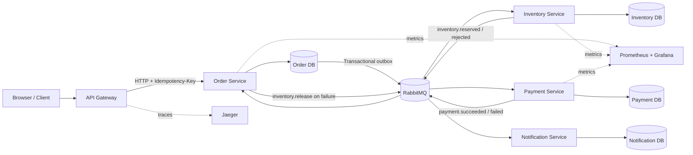
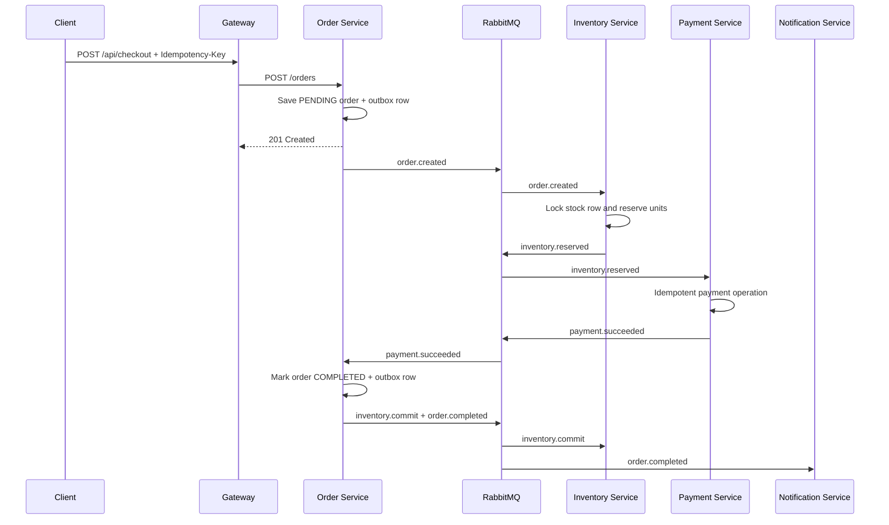

# ResilientCart

**An event-driven checkout and order-fulfillment platform built to demonstrate practical system-design patterns under concurrency and partial failure.**

ResilientCart is an original portfolio project composed of five Python services, RabbitMQ, PostgreSQL, OpenTelemetry, Jaeger, Prometheus, and Grafana. It implements a checkout Saga with transactional outboxes, idempotent consumers, row-level stock locking, delayed retries, dead-letter queues, and compensating transactions.

> Portfolio note: benchmark numbers are intentionally not pre-filled. Run the included tests, record the environment, and publish only measurements you can reproduce and explain.

## Architecture



## System-design concepts demonstrated

| Concern | Implementation |
|---|---|
| Distributed transaction | Choreographed Saga across order, inventory, and payment services |
| Dual-write problem | Transactional outbox stored in the same database transaction as domain state |
| Duplicate HTTP requests | Unique idempotency key returns the original order |
| Duplicate event delivery | Durable `processed_events` records and unique business keys |
| Inventory concurrency | PostgreSQL row-level locks with atomic available/reserved/sold updates |
| Payment failure | Compensating `inventory.release` event |
| Transient consumer failure | Delayed retry queue with a configurable retry limit |
| Poison message | Service-specific dead-letter queue |
| Observability | OpenTelemetry traces, correlation IDs, JSON logs, Prometheus metrics, Grafana dashboard |
| Service ownership | Separate logical database per stateful service |

## Checkout sequence



For a simulated decline, use a customer ID ending in `-fail`. The order service emits `inventory.release`, restoring the reserved stock.

## Run locally

### Prerequisites

- Docker Desktop or Docker Engine with Compose v2
- At least 6 GB of free memory recommended for the full observability stack

### Start the platform

```bash
cp .env.example .env
docker compose up --build -d
docker compose ps
```

Open the interactive demo at **http://localhost:8080**.

| Interface | URL | Default credentials |
|---|---|---|
| Demo and API gateway | http://localhost:8080 | None |
| OpenAPI | http://localhost:8080/docs | None |
| RabbitMQ management | http://localhost:15672 | `resilientcart` / `resilientcart` |
| Jaeger traces | http://localhost:16686 | None |
| Prometheus | http://localhost:9090 | None |
| Grafana | http://localhost:3000 | `admin` / `admin` |

Stop the stack with:

```bash
docker compose down
```

Remove databases and queues for a clean run:

```bash
docker compose down -v --remove-orphans
```

## Demo scenarios

### Successful checkout

Use the web interface or run:

```bash
python scripts/smoke_test.py
```

Expected terminal state: `COMPLETED`.

### Failed payment and compensation

```bash
python scripts/smoke_test.py --customer-id recruiter-demo-fail
```

Expected terminal state: `PAYMENT_FAILED`; the inventory reservation is released asynchronously.

### HTTP idempotency

```bash
python scripts/duplicate_test.py --requests 50
```

All 50 concurrent requests use one idempotency key and should return exactly one order ID.

### Inventory contention

```bash
python scripts/contention_test.py --attempts 1000 --stock 100
```

The expected invariant is exactly 100 completed orders, 900 rejected orders, 100 sold units, and zero oversold units. Record the output from your own machine before using the result on a resume.

### Service interruption

```bash
bash scripts/failure_test.sh
```

This stops the payment service, submits an order, and restarts the service. The queued event should be processed after recovery.

## Load testing

Install the Python dependencies locally, start the stack, and run:

```bash
mkdir -p benchmark-results
locust \
  -f load-tests/locustfile.py \
  --headless \
  --users 100 \
  --spawn-rate 10 \
  --run-time 10m \
  --host http://localhost:8080 \
  --csv benchmark-results/load
```

Copy your measured throughput, p95 latency, p99 latency, failure rate, test duration, hardware, and commit SHA into [`BENCHMARKS.md`](BENCHMARKS.md). Do not describe target values as measured results.

## Automated checks

```bash
pytest -q
ruff check app tests scripts load-tests --select E9,F63,F7,F82
python -m compileall -q app tests scripts load-tests
```

GitHub Actions executes the same checks, validates the Compose file, and builds the application image on every push to `main` and every pull request.

## API summary

| Method | Endpoint | Purpose |
|---|---|---|
| `POST` | `/api/checkout` | Create or replay an idempotent checkout request |
| `GET` | `/api/orders/{id}` | Read current order state |
| `GET` | `/api/inventory/{item_id}` | Read available and reserved stock |
| `PUT` | `/api/inventory/{item_id}` | Reset demo stock |
| `GET` | `/api/notifications` | Inspect recorded order notifications |

## Repository structure

```text
app/
  common/                 Messaging, outbox, telemetry, metrics, database utilities
  gateway/                Public API and interactive demo
  order_service/          Order state machine and Saga coordination
  inventory_service/      Transactional stock reservation and release
  payment_service/        Idempotent payment simulation
  notification_service/   Durable completion/failure notifications
deploy/k8s/                Demo Kubernetes manifests
infrastructure/            PostgreSQL, Prometheus, and Grafana configuration
load-tests/                Locust workload
scripts/                   Smoke, duplicate, contention, and failure tests
tests/                     Unit and idempotency tests
docs/                      Architecture, capacity, failure analysis, and ADRs
```

## Design documentation

- [Architecture and event contracts](docs/architecture.md)
- [Capacity-estimation worksheet](docs/capacity-estimation.md)
- [Failure scenarios](docs/failure-scenarios.md)
- [Trade-offs and production improvements](docs/tradeoffs.md)
- [ADR 001: RabbitMQ](docs/adr/001-rabbitmq.md)
- [ADR 002: Choreographed Saga](docs/adr/002-choreographed-saga.md)
- [ADR 003: Database per service](docs/adr/003-database-per-service.md)

## Resume bullets after validation

Replace bracketed values with results produced by your own test run:

- Designed a five-service event-driven checkout platform using RabbitMQ, PostgreSQL, Saga choreography, and transactional outboxes, sustaining **[RPS] requests/second at [P95] ms p95 latency** on **[hardware]**.
- Processed **[N] test transactions** with zero duplicate orders and prevented overselling during **1,000 concurrent purchase attempts for 100 units** using idempotency records and row-level database locks.
- Executed **[N] failure-injection runs** across payment and messaging components and instrumented the system with OpenTelemetry traces, Prometheus metrics, Grafana dashboards, structured logs, delayed retries, and dead-letter queues.

## Limitations

This is a portfolio system, not a payment product. The payment provider is simulated, secrets are configured for local development, PostgreSQL and RabbitMQ run as single instances, schema migrations are replaced by startup table creation, and the Kubernetes manifests are demo-grade. See [`docs/tradeoffs.md`](docs/tradeoffs.md) for the production roadmap.

## License

MIT
